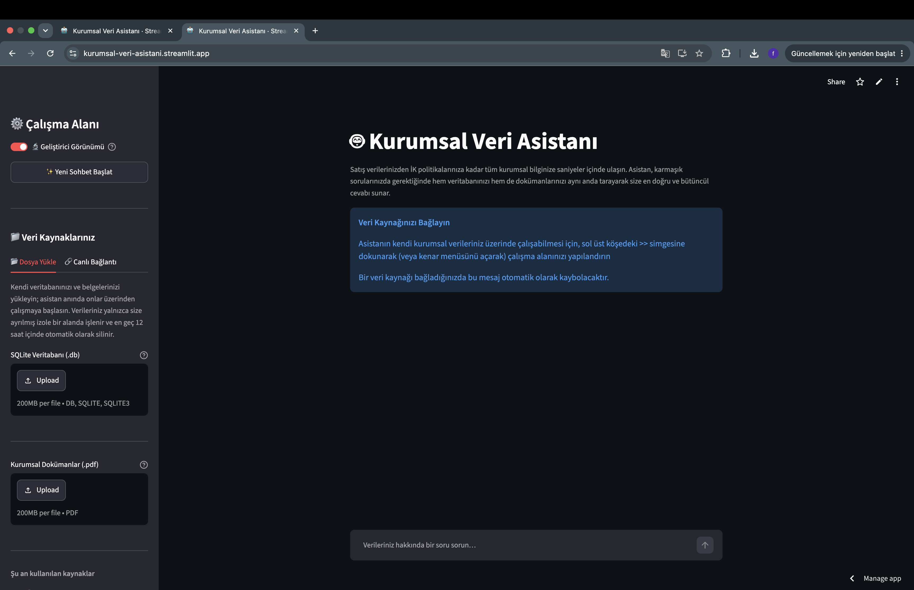
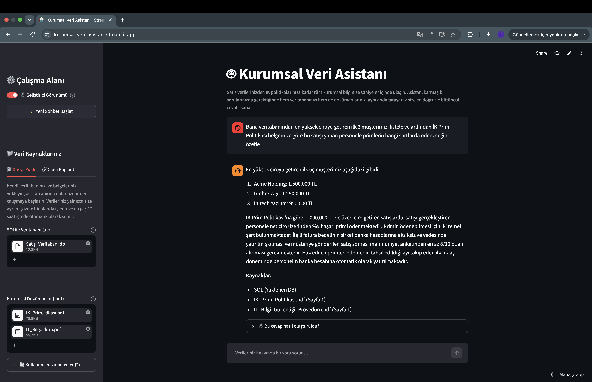
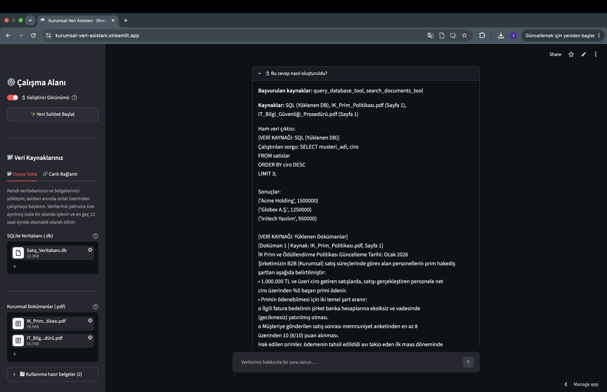

[🇹🇷 Türkçe Dokümantasyon için tıklayın (README-tr.md)](README-tr.md) | 🇬🇧 English (you are here)

# 🤖 Corporate Data Assistant

> An **Autonomous Decision Support System** (Agentic RAG + SQL Coder) that acts as a virtual data analyst — not a chatbot. It reasons about a natural-language question, autonomously chooses which data sources to consult, writes and executes its own SQL against live or uploaded databases, retrieves relevant passages from corporate PDFs, and synthesizes a single grounded answer with citations.

<p align="left">
  
  
  
  
  
  
  
  
</p>

---

## 📸 Demo & Screenshots

|        Onboarding (Empty State)         |    Composite Query + Sources    |             Developer View              |
|:---------------------------------------:|:-------------------------------:|:---------------------------------------:|
|  |  |  |

---

## 🚀 Why This Is Not "Just a Chatbot"

A standard RAG chatbot embeds documents and answers from a single vector store. This system is an **agent** built on a LangGraph tool-calling loop. For every question it decides — at runtime — *which* capabilities to invoke, and it can invoke **more than one in a single turn**.

- **🧠 Agentic Tool Calling (not a static router).** The LLM is bound to two tools — `query_database_tool` and `search_documents_tool` — and chooses between them, or calls **both in parallel**, based on the question. A composite request like _"Show me last month's top-selling product **and** our VIP return policy"_ triggers a database query **and** a document search in the same turn, then a single synthesized answer.

- **🛠️ Self-Correcting SQL Coder.** SQL is generated from natural language and executed. If execution fails (bad column, wrong join, dialect mismatch), the error text is fed **back into the SQL-generation prompt** and the agent rewrites the query — up to **3 attempts** — before surfacing a graceful failure. The retry budget is bounded, and the error is used as a repair signal, not just logged.

- **🌐 Dialect-Aware Generation.** The SQL prompt adapts to the active engine. Connect PostgreSQL and it uses `DATE_TRUNC` / `||`; connect SQL Server and it switches to `TOP N` / `OFFSET-FETCH`; SQLite gets `STRFTIME`. Six dialects are supported: **SQLite, PostgreSQL, MySQL, MariaDB, MSSQL, Oracle**.

- **🔒 Ruthless Grounding + Deterministic Verification.** The synthesis prompt forbids the model from using its own trained knowledge — only retrieved data. On top of that (because prompting is probabilistic), a **deterministic numeric check** extracts every number in the answer and verifies it appears in the source context; any ungrounded figure triggers a visible verification warning. This exists specifically to catch hallucinations like a model answering "30 days" when the document says "45 days".

- **📎 Clean, Deterministic Citations.** Source attribution (file name + page for documents, source label for SQL) is **collected by code** from actual tool outputs and listed at the end of every answer — never invented by the LLM, never interleaved mid-sentence.

---

## ✨ Key Features

### Hybrid Data Strategy (Agentic Routing)
The agent autonomously targets one of three source types, with a strict priority order when several are configured:

```
Live SQL Database  >  Uploaded SQLite (.db) file  >  Default demo data
```

Documents are handled by a separate tool, so a question can hit structured data and unstructured policy text simultaneously.

### Multi-Tenant Isolation & Security (SaaS Architecture)
- **Per-session UUID.** Every session gets a unique data-session identifier; all uploaded files and vector stores live under an isolated per-session directory.
- **Mathematically impossible cross-document contamination.** Each upload attempt writes to a **freshly generated, unique** vector-store directory. Even if a previous cleanup fails, a new upload can never read stale vectors from an old one.
- **Credentials never reach the LLM.** Live-database connection strings are passed to tools via LangGraph's `InjectedState` — they are **absent from the tool schema the model sees**. Connection strings are redacted in all logs and in the developer panel.
- **Read-only by design.** A SQL security guard executes **only `SELECT`** statements. `DROP` / `DELETE` / `UPDATE` / `INSERT` are rejected before execution — for uploaded files and live connections alike. (A read-only DB user is still recommended as defence in depth.)

### Smart Garbage Collection (Ephemeral Data)
- On startup, any tenant session directory older than **12 hours** is swept — so even a hard crash that skips normal cleanup is self-healing on the next boot.
- Active sessions "touch" their directory each interaction, so a long-lived session is never collected out from under the user.
- Removing or replacing a source deletes its store from disk immediately.

### Transparent Debug UX ("Geliştirici Görünümü" / Developer View)
A toggleable panel shows, per answer: **which tools the agent called**, the **exact SQL executed**, the **raw retrieved data**, and the **deterministic source list**. Full transparency into the agent's reasoning trail.

### Professional UI
- **Smart empty state / onboarding** that guides users to configure a data source and disappears automatically once one is connected.
- **Live connection testing** — a database URL is validated at connect-time, not on the user's first question.
- **Resilient file handling** — content validated by magic bytes (not extension), multi-file PDF ingestion, per-attempt error recovery with no "stuck" states, and graceful partial-success handling.
- **Token-by-token streaming** with live status updates during tool execution.

---

## 🏗️ System Architecture

### The Tool-Calling Loop
The engine is a LangGraph `StateGraph` compiled with a `MemorySaver` checkpointer for conversational memory.

```
                     ┌─────────────────────────────┐
                     ▼                             │
   [User Question] → agent ──(tool calls?)──→ tools node
                       │                          │
                       │ (no tool calls)          └─ results appended to state
                       ▼
                     prune ──→ [END] ──→ Spokesperson (grounded synthesis)
```

1. **`agent` node** — a `gpt-4o-mini` model bound to the two tools. Acts as a dispatcher: decides which tools (zero, one, or several in parallel) to call. It does **not** write the final answer.
2. **`tools` node** — LangGraph's `ToolNode` executes the calls. `query_database_tool` runs the self-correcting SQL flow; `search_documents_tool` runs RAG retrieval. Both receive tenant context (paths, credentials) via `InjectedState`.
3. **`prune` node** — after each turn, large intermediate tool traffic (SQL rows, document chunks) is removed from message history, keeping the checkpoint small and preventing memory bloat over long conversations. User questions and final answers are retained for context.
4. **Spokesperson (service layer)** — a separate streaming `gpt-4o-mini` call synthesizes the final Turkish answer **strictly from tool outputs**, under the grounding rules and deterministic numeric verification described above. Keeping synthesis separate from dispatch is what makes the grounding guarantee enforceable.

A `MAX_TOOL_ITERATIONS` safety valve prevents infinite tool loops.

### RAG Pipeline (Upload-Time Vectorization)
PDFs are chunked and embedded **once, at upload time**, into a persistent per-session ChromaDB store (`text-embedding-3-small`). At query time the store is only **connected to** — documents are never re-embedded, so repeated questions add zero embedding cost. Retrieval adapts `top-k` to the number of documents (more files → wider recall, capped), and every chunk carries its source filename and page for citation.

### Three-Layer Separation of Concerns

| Layer | Files | Responsibility |
| :--- | :--- | :--- |
| **UI** | `app.py` | Presentation, session state, uploads, onboarding. Knows nothing of LangGraph internals. |
| **Service** | `chat_engine.py` | Translates graph events into a UI-facing stream; runs the grounded Spokesperson + verification. |
| **Engine** | `graph.py`, `agent.py`, `database.py`, `sql_generator.py`, `rag_node.py` | Tool-calling loop, tools, DB access, dialect-aware SQL generation, RAG lifecycle. |

---

## ⚙️ Installation & Setup

### Prerequisites
- Python **3.11** or **3.12**
- An **OpenAI API key**

### 1. Clone the repository
```bash
git clone https://github.com/furkansevinc007/kurumsal-veri-asistani.git
cd kurumsal-veri-asistani
```

### 2. Create a virtual environment
```bash
python -m venv venv
# macOS / Linux
source venv/bin/activate
# Windows
venv\Scripts\activate
```

### 3. Install dependencies
```bash
pip install -r requirements.txt
```

### 4. Provide your OpenAI API key

**Local development** — create a `.env` file in the project root:
```env
OPENAI_API_KEY=sk-your-key-here
```

**Streamlit Community Cloud** — add it under **Settings → Secrets** instead:
```toml
OPENAI_API_KEY = "sk-your-key-here"
```

### 5. Run
```bash
streamlit run app.py
```
Open the sidebar (the **›** icon, top-left) to upload a `.db` / PDF or connect a live database, then start asking questions.

> **☁️ Deploying to Streamlit Community Cloud?** The repository ships with a critical SQLite compatibility patch at the top of `app.py` (swapping the system `sqlite3` for `pysqlite3-binary`), because Cloud's default SQLite is too old for ChromaDB. This is already handled — just keep `pysqlite3-binary` in `requirements.txt`.

---

## 🧰 Tech Stack

| Category | Technology |
| :--- | :--- |
| **Language** | Python 3.11 / 3.12 |
| **Frontend** | Streamlit |
| **Agent Orchestration** | LangGraph (tool-calling `StateGraph`, `ToolNode`, `InjectedState`, `MemorySaver`) |
| **LLM Framework** | LangChain |
| **Models** | OpenAI `gpt-4o-mini` (reasoning + synthesis), `text-embedding-3-small` (embeddings) |
| **Vector Store** | ChromaDB (persistent, per-session) |
| **Database / ORM** | SQLAlchemy 2.0 — SQLite, PostgreSQL, MySQL, MariaDB, MSSQL, Oracle |
| **Document Parsing** | pypdf |

---

## ⚠️ Notes & Limitations
- The system executes **read-only** queries. A read-only database user is recommended for live connections.
- On Streamlit Community Cloud, storage is **ephemeral** — uploaded data does not survive an app restart. The 12-hour garbage collector and "please re-upload" flows handle this gracefully.
- MSSQL and Oracle are supported by the SQL generator, but their drivers (`pyodbc` / `oracledb`) require system-level components not available on Streamlit Cloud; use a self-hosted environment for those.

---

## 📄 License
Distributed under the MIT License. See `LICENSE` for details.

---

<p align="center"><i>Built as a demonstration of production-minded Agentic AI architecture — autonomous routing, self-correction, multi-tenant isolation, and enforceable grounding.</i></p>